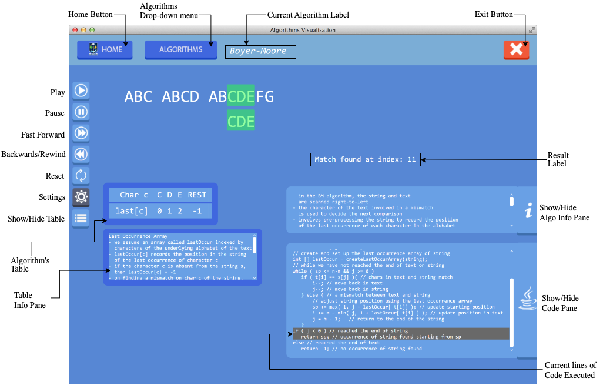

# String Matching Algorithms Visualisations

This repository contains visualisations of various string matching algorithms, created as part of my Master's Degree in Software Development at the University of Glasgow, Scotland. This project was developed as my final project, showcasing step-by-step visualisations of string-matching algorithms. Upon completion the app was used as a course companion for the Algorithms course in the University.

## Description

String matching is a fundamental problem in computer science, and understanding these algorithms can be challenging. This project visualises the internal workings of several string matching algorithms, making it easier to understand their behavior and efficiency.

### Demo Video

You can have a quick look at a short demo [here](https://www.loom.com/share/4dc81aa6779148dbb77b7b00b2c83d34?sid=bb3c9b0c-cc32-4075-9c9f-422b6f40eaab)

### Algorithms supported

The following algorithms are supported:

- Boyer Moore
- Horspool
- NotSoNaive
- Smith
- BruteForce
- KMP
- QuickSearch
- TwoWay

### Features

- Step-by-step visualisation of each algorithm
- Comparison of different algorithms
- User-friendly interface
- Parallel code execution and visualisation

### Run it!

You can also download the jar file located in

Download the zip file [here](resources/executables/VIS_ALGO_JAR.zip) and feel free to run the jar file with a java launcher.

Happy learning! 🌟

## ☎️ Get in Touch

I'm always open to discussions, collaborations, and feedback. If you have any questions or just want to connect, feel free to reach out!

- **Email:** gbouramas@gmail.com
- **LinkedIn:** [Giannis Bouramas](https://www.linkedin.com/in/bouramas)
